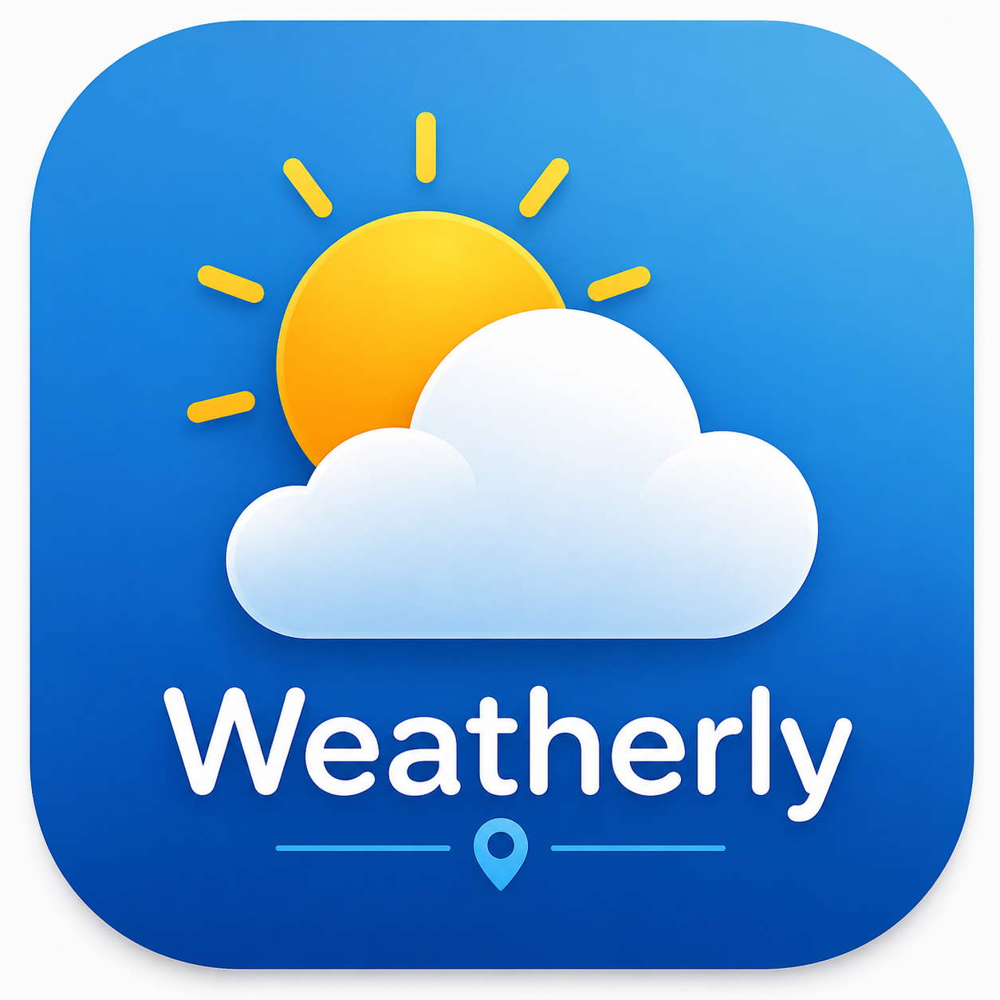

# 🌤️ Weatherly

<p align="center">
  
</p>

<p align="center">
  <strong>A modern Flutter weather application for searching and viewing current weather information for cities around the world.</strong>
</p>

<p align="center">
  
  
  
  
</p>

---

## 📱 About the Project

Weatherly is a modern Flutter weather application that allows users to search for any city around the world and view its current weather information.

The project was developed as part of **Week 4 of the NextGenatix App Development Internship**, focusing on API integration, JSON parsing, asynchronous programming, state management, loading states, and error handling.

The application follows a simple architecture where the UI communicates with the **Provider**, the Provider communicates with the **API Service**, and the API Service handles communication with the external APIs.

---

## ✨ Features

- 🌍 Search for cities worldwide
- 🔎 Simple city search functionality
- 🌡️ Display current temperature
- ☁️ Display current weather condition
- 🌤️ Display weather icon
- 📍 Display city and country
- 🧭 Display latitude and longitude
- ⏳ Loading indicator while fetching data
- ⚠️ Graceful API error handling
- 📝 Empty state before searching
- 🔄 Refresh weather information
- 🎨 Modern Material 3 interface
- 📱 Responsive user interface
- 🌙 Dark weather-themed design
- ✨ Modern splash screen
- 🚀 Custom application launcher icon

---

## 🛠️ Technologies Used

| Technology | Purpose |
|------------|---------|
| Flutter | Application development |
| Dart | Programming language |
| Provider | State management |
| HTTP | API communication |
| Open-Meteo | Weather and geocoding data |
| Material 3 | Modern user interface |
| JSON | API data processing |
| ChangeNotifier | State updates |

---

## 🏗️ Project Architecture

Weatherly follows a simple layered architecture:

```text
┌─────────────────────┐
│      Home Screen    │
│         UI          │
└──────────┬──────────┘
           │
           ▼
┌─────────────────────┐
│   WeatherProvider   │
│  State Management   │
└──────────┬──────────┘
           │
           ▼
┌─────────────────────┐
│     API Service     │
│   HTTP Requests     │
└──────────┬──────────┘
           │
           ▼
┌─────────────────────┐
│   Open-Meteo APIs   │
└─────────────────────┘
```

### Data Flow

```text
User enters city
       ↓
Home Screen
       ↓
WeatherProvider
       ↓
API Service
       ↓
Geocoding API
       ↓
Latitude + Longitude
       ↓
Weather API
       ↓
Weather Data
       ↓
WeatherModel
       ↓
Provider
       ↓
Home Screen
```

The UI does not directly communicate with the API service. The **Provider acts as the intermediate layer** between the UI and API service.

---

## 📂 Project Structure

```text
lib/
│
├── core/
│   │
│   ├── provider/
│   │   ├── provider.dart
│   │   └── weather_model.dart
│   │
│   └── services/
│       └── api_service.dart
│
├── features/
│   │
│   ├── home/
│   │   └── home_screen.dart
│   │
│   └── splash/
│       └── splash_screen.dart
│
└── main.dart
```

### Core

Contains the application's main reusable logic.

### Provider

Manages weather state using `ChangeNotifier` and communicates with the API service.

### Weather Model

Stores the weather information received from the APIs.

### API Service

Handles HTTP requests and communication with the Open-Meteo APIs.

### Home Screen

Provides the city search interface and displays the weather information.

### Splash Screen

Provides the initial application screen before navigating to the main weather screen.

---

## 🌐 APIs Used

### 📍 Open-Meteo Geocoding API

The Geocoding API converts a city name into geographical information.

It provides:

- City name
- Country
- Latitude
- Longitude

```text
https://geocoding-api.open-meteo.com/v1/search
```

### 🌤️ Open-Meteo Weather API

The Weather API uses latitude and longitude to retrieve current weather information.

The application retrieves:

- Current temperature
- Weather condition code
- Current weather information

```text
https://api.open-meteo.com/v1/forecast
```

Open-Meteo does not require an API key for the use case implemented in this project.

---

## 🔄 How It Works

When a user searches for a city, Weatherly performs the following process:

```text
"Islamabad"
     ↓
Geocoding API
     ↓
Latitude + Longitude
     ↓
Weather API
     ↓
Current Weather
     ↓
WeatherModel
     ↓
Weather Card
```

This approach allows the application to support cities from around the world rather than being limited to a specific country.

---

## 🎨 User Interface

Weatherly uses a modern dark-themed Material 3 interface with a consistent weather-focused design.

The main interface includes:

- 🔎 Search field
- 🔍 Search button
- ⏳ Loading state
- 📝 Empty state
- ⚠️ Error state
- 🌤️ Weather information card
- 🌡️ Temperature display
- ☁️ Weather condition
- 📍 Location information
- 🧭 Latitude and longitude
- 🔄 Refresh button

---

## ⚠️ Error Handling

Weatherly handles different application states gracefully.

### Empty Search

If the user tries to search without entering a city:

> Please enter a city name first

### Loading

While weather information is being retrieved, a loading indicator is displayed.

### Invalid City

If the requested city cannot be found, the application displays an appropriate error message.

### API Error

If an API request fails, the application shows an error state instead of crashing.

---

## 🚀 Getting Started

### Prerequisites

Make sure you have the following installed:

- Flutter SDK
- Dart SDK
- Android Studio or VS Code
- Android emulator or physical Android device

### Clone the Repository

```bash
git clone https://github.com/abdulsamad010/weatherly_flutter.git
```

### Navigate to the Project

```bash
cd weatherly_flutter
```

### Install Dependencies

```bash
flutter pub get
```

### Run the Application

```bash
flutter run
```

### Run on Chrome

```bash
flutter run -d chrome
```

---

## 📚 Learning Outcomes

This project provided practical experience with:

- REST API integration
- HTTP GET requests
- API query parameters
- JSON response handling
- Asynchronous programming
- `Future` and `async/await`
- Provider state management
- `ChangeNotifier`
- `notifyListeners()`
- Loading state management
- Error handling
- Separation of UI and API logic
- Modern Flutter UI development
- Responsive interface design

---

## 🎯 Internship Task

### NextGenatix App Development Internship

**Week:** 4  
**Task:** API Integration & Mini Project

### Objective

Learn API integration through a practical Flutter mini project.

### Topics Covered

- HTTP Package
- API Integration
- JSON Parsing
- Future / Async-Await
- Error Handling
- Provider
- ChangeNotifier

---

## 🔮 Future Improvements

Possible future improvements include:

- 📍 Automatic current-location weather
- ⭐ Favorite cities
- 🕒 Search history
- 📅 Multi-day weather forecast
- 💨 Wind speed and direction
- 💧 Humidity information
- 🌡️ Feels-like temperature
- 🌅 Sunrise and sunset information
- 🔔 Weather alerts
- 🌙 Dynamic day/night themes

---

## 👨‍💻 Developer

### Abdul Samad

**Flutter Developer | AI & Machine Learning**

- **GitHub:** [abdulsamad010](https://github.com/abdulsamad010)
- **LinkedIn:** [Abdul Samad](https://www.linkedin.com/in/abdulsamad010/)

---

## 📄 License

This project is licensed under the **MIT License**.

---

## 🙏 Acknowledgements

- **NextGenatix** — Internship and learning opportunity
- **Flutter** — Application development framework
- **Dart** — Programming language
- **Open-Meteo** — Weather and geocoding APIs
- **Provider** — State management

---

<p align="center">
  <strong>Built with ❤️ using Flutter & Dart</strong>
</p>

<p align="center">
  ⭐ If you find this project useful, consider giving the repository a star!
</p>